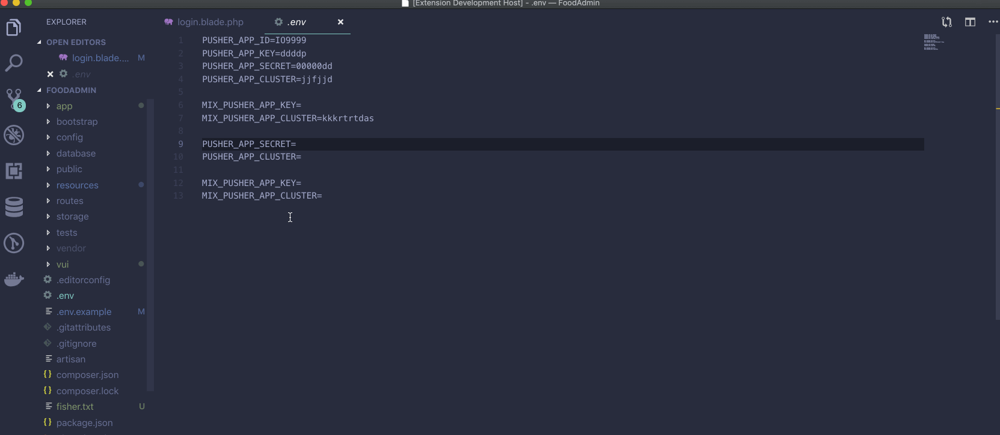
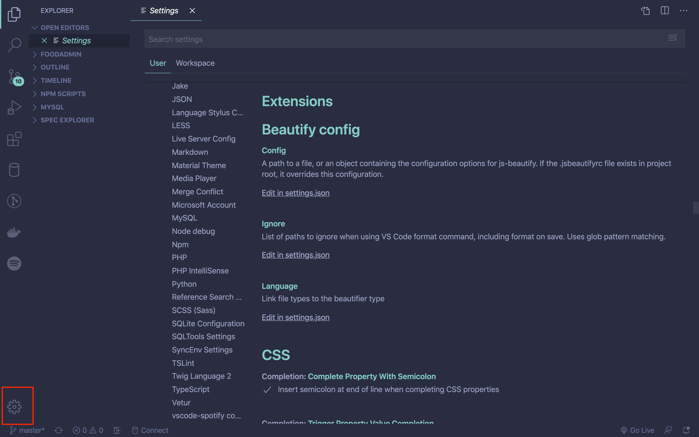
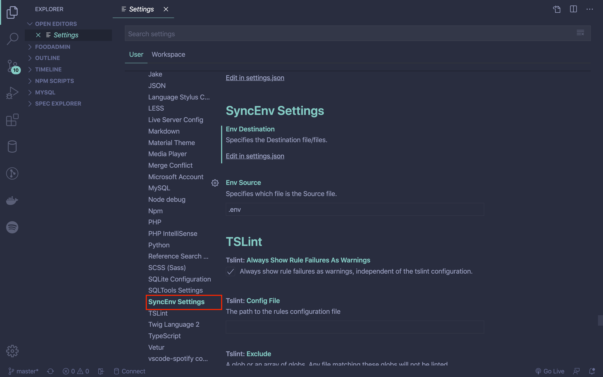
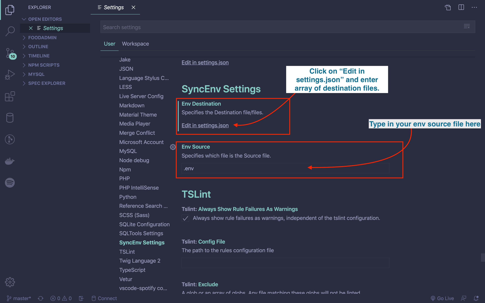
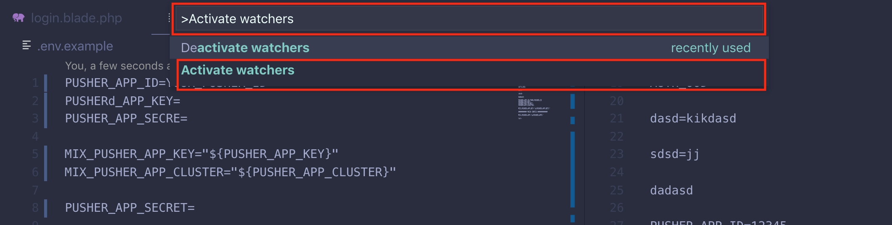
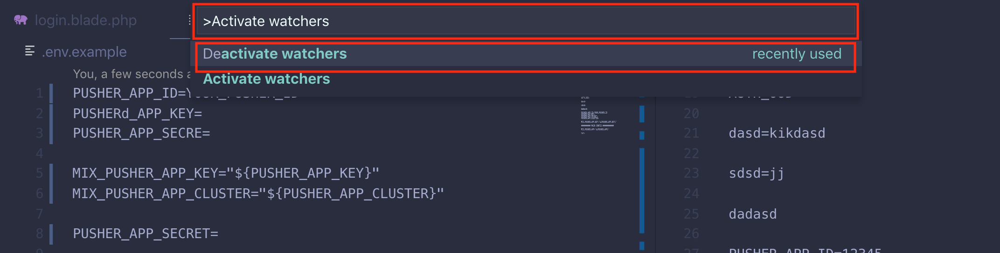

# env sync

Note: This is forked from the original 'sync-env' extension, but using the latest VSCode features, to allow::
- Extension now fully works with local Windows file systems

This extension helps you keep your env files in sync. Once you have installed the `env-sync` extension, it will begin synchronizing any source env file and destination env file/files found in your project root folder. It also works with sub folders too.

## Installing

Download and install it from the vs-code market [here](#)

## Configuring sync files

The extension assumes that your config files are `.env`(source) and `.env.example`(destination) by dfault. Sure, this is not the case most of the time. You can specify which file is your source file and which is the destination file.

To configure:

1. Click on the settings Icon:

2. Then click on **SyncEnv Settings**:

3. Finally, set your files as you wish:

> **Note** that the `Env Destination` can be a string or an array. Example: ".env.local" 
> OR 
> `[
    ".env.example",
    ".env.local",
    ".env.development"
]`

> **Note** that the `Env Source` is just be a string. Example of input is: `.env.development`

## Activating and Deactivating

The extension is activated automatically by default when it is first installed. In case you have deactivated it before, you can activate it using by:

1. Shift + Command + P
2. Type into the command pallet - `Activate Watchers` to bring out the command, then click on it.

To deactivate the extension:

1. Shift + Command + P
2. Type into the command pallet - `Deactivate Watchers` to bring out the command, then click on it to deactivate the extension.

# CHANGELOG

Notable changes:

## [1.0.0] - 2021-05-26

### Added
- Forked from un-maintained `sync-env` extension 
- Fully supports Windows-based filesystem, unlike the previous extension which only supported Unix-like systems (MacOS & Linux)
